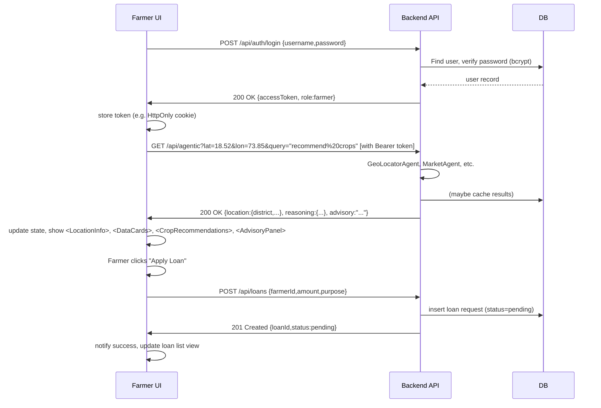
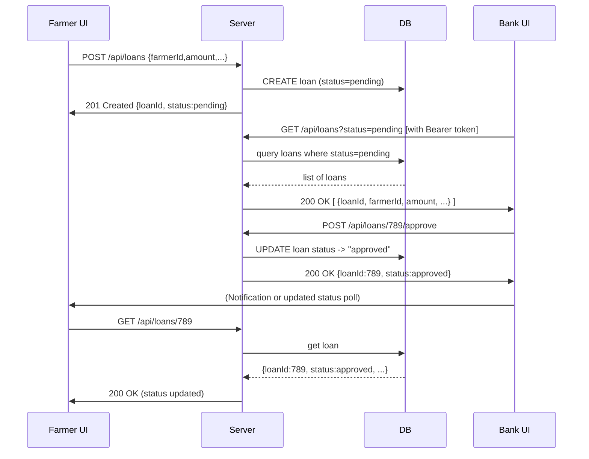
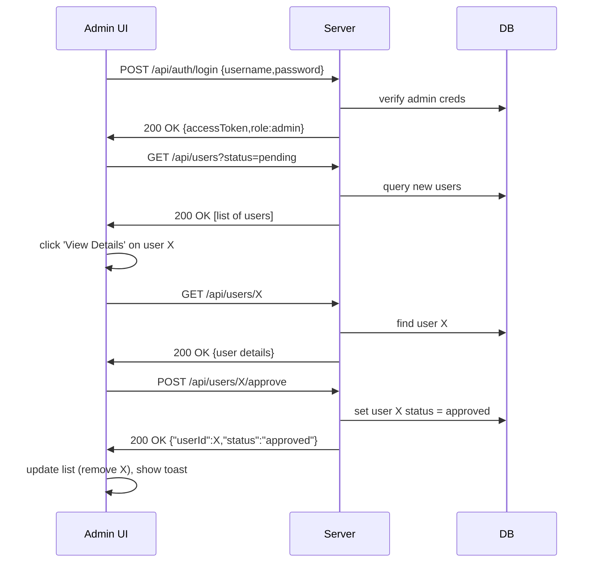

# Smart Crop AI – Backend–Frontend Flows & Authentication  

This report details the end-to-end web app flows for Smart Crop AI, covering initial state, authentication for **Farmer**, **Admin**, and **Bank** roles, UI actions, API calls, and security.  The FastAPI backend (per the provided architecture) exposes RESTful endpoints (e.g. `/locate`, `/filter`, `/agentic`) that return geodata, filtered crops, and full AI-driven recommendations.  We assume a standard REST API over HTTPS (TLS) with token-based auth (e.g. JWT), since all endpoints must be protected.  In the absence of specific framework details, we align with common best practices (Express/Django/Spring-style routing, secure session or JWT handling, proper HTTP status codes, etc.).  

## Executive Summary  
Smart Crop AI is a multi-role web platform: farmers input location to get crop advice; administrators oversee users and data; banks manage loan requests.  On launch, the app shows a generic **Login** screen (no user is authenticated), as all API endpoints require login.  Users (farmer, admin, bank) log in via a shared endpoint (`POST /api/auth/login`), submitting credentials (e.g. `{"username":"...", "password":"..."}`). The server verifies them (hashing passwords, rate-limiting to prevent brute-force) and returns a signed JWT (plus optional refresh token) in a JSON response.  The frontend stores the token (ideally in an HttpOnly cookie or in-memory, not in localStorage) and redirects to a role-specific dashboard. A **Register** flow (`POST /api/auth/register`) similarly creates new users (201 Created on success). Throughout, standard REST patterns are used: resource-based paths (nouns, no verbs) and proper HTTP methods/statuses.  

Once logged in, each button or form triggers a precise API call. For example, the farmer’s *“Submit Location”* button causes a `GET /api/agentic?lat=…&lon=…&query=recommend%20crops`. The backend runs its full agent pipeline and returns JSON like: 
```json
{ 
  "location": { "state":"Maharashtra", "district":"Pune", "season":"Rabi" },
  "reasoning": {
     "inputs": {
       "weather": {"temperature_C":30,"humidity":40},
       "soil": {"nitrogen":20,"phosphorous":15},
       "market": {"crop":"maize","avg_price":2135,"trend":"rising"}
     },
     "system_recommendations": [
       {"crop":"maize","confidence":0.95},
       {"crop":"sugarcane","confidence":0.90}
     ],
     "llm_reasoning": "Maize and sugarcane are excellent for Pune this Rabi season..."
  },
  "advisory": "Maize is ideal for Pune district this Rabi season..."
}
```
(This matches the architecture’s `GET /agentic` which *“returns: location, reasoning, advisory”*.)  The UI then updates state: it saves `locationData` and `recommendations` in React state, causing `<LocationInfo>`, `<DataCards>`, `<CropRecommendations>`, and `<AdvisoryPanel>` components to render with the new data. Any API error (e.g. 400/500) sets an error state and shows an `<ErrorMessage>` alert. Approvals, rejections, and detail views similarly call REST endpoints (e.g. `POST /api/loans/{id}/approve`) and the UI refreshes lists or fields based on the JSON response.

Below, we break down each role’s auth flow, then describe every assumed UI action (`Login`, `Logout`, `Submit`, `Approve/Reject`, `View Details`, `Register`), listing the API calls, backend operations, DB interactions, and UI updates. We include Mermaid sequence/flow diagrams and tables summarising endpoints, payloads, and responses.  **Assumptions:** the MDs focus on the AI pipeline and do not specify auth or loan features, so we assume standard user management (with salted password hashes and JWTs) and a loan application component linking farmers and banks.  All traffic is over HTTPS; CSRF protections (e.g. `SameSite` cookies or CSRF tokens) would be needed if cookies are used.  

## Initial State (App Startup)  
When the server starts and no user is logged in, the frontend shows a **Login** page by default. This ensures all endpoints remain protected (per REST security best practice that *“no endpoint should accept unauthenticated traffic”*).  The login screen typically includes fields for username/password (and possibly a role selector or separate role portal), plus a link to **Register** if allowed. This screen is served from the React app’s root (`/login`). Until a valid auth token is obtained, attempting to navigate elsewhere triggers an automatic redirect back to login. The backend’s root `GET /` might be a health-check (no auth), but the UI itself enforces the login-first rule.  

## Authentication Flows  

### Farmer Login  
**Endpoint:** `POST /api/auth/login` (or `/login`). The farmer enters credentials and clicks **Login**. The frontend sends JSON like `{"username":"farmer1","password":"secret"}`. The backend validates against the users DB (e.g. SQL/NoSQL).  *If valid*, it issues a short-lived JWT access token and long-lived refresh token. Response example (HTTP 200): 
```json
{
  "accessToken": "eyJhbGci...", 
  "refreshToken": "eyJh...long",
  "user": {"id":123, "username":"farmer1", "role":"farmer"}
}
``` 
The client stores the access token in memory or an HttpOnly cookie (to mitigate XSS), and the refresh token securely (cookie or protected storage). The UI clears any error, sets `isAuthenticated=true`, and redirects to the **Farmer Dashboard**. If *invalid* (wrong creds), the server returns 401 Unauthorized. The frontend catches this and sets an error state, causing the `<ErrorMessage>` to display (“Invalid username or password”).

*Security:* On the backend, passwords are hashed (bcrypt/Argon2) before DB storage. Rate-limiting (e.g. 5 failed attempts per 15 min) thwarts brute force. All auth occurs over HTTPS. The token’s claims should include the user’s role and expiration; the backend will check this JWT on every protected call.  

### Administrator Login  
Admins use the same form (`POST /api/auth/login`); their credentials yield a token with `"role":"admin"`. On success, the frontend redirects to an **Admin Dashboard** (e.g. route `/admin`).  The admin dashboard might list pending user registrations or logs. The login flow (request/response) is identical to the farmer’s, except the UI target differs. Errors (401) and token handling are the same. We assume only an initial super-admin exists or admins are pre-provisioned (no public register for admin).  

### Bank Login  
Similarly, a bank officer logs in via `POST /api/auth/login` and gets a token with `"role":"bank"`. A successful response (200) returns JSON with tokens and user info, after which the app navigates to `/bank`. The **Bank Dashboard** likely shows loan applications awaiting review. Again, invalid creds yield 401 and a frontend error.  

### Register (Farmer/Bank)  
We assume **Farmers** (and possibly Banks) may self-register. Clicking **Register** opens a form (e.g. `/register`). On submit, the frontend sends `POST /api/auth/register` with e.g.:
```json
{
  "username": "farmer2",
  "password": "newpass",
  "fullName": "Alice Farmer",
  "role": "farmer"
}
```
The backend checks for duplicate username (returning 400 if taken), hashes the password, creates the user, and responds 201 Created with `{"message":"User registered successfully","userId":456}`. The UI then might auto-login the user or prompt them to return to login. (Admins might require manual approval of new accounts, but that is an additional process not specified in the MDs.)  

## API Calls & Page Transitions per UI Action  

Below we detail every key UI action (button/form) and its backend interaction.  The components and pages below are derived from the MDs and common conventions:

- **Login (button):** On click, trigger the login flow above.  
- **Logout (link/button):** Calls `POST /api/auth/logout`.  
- **Submit (forms):** E.g. submitting location or loan request.  
- **Approve / Reject (buttons):** Used by Admin/Bank to approve user/loan.  
- **View Details (links):** Opens details for a selected item.  
- **Register (button):** Triggers the registration endpoint.  

For each, we list the HTTP endpoint, method, request/response schemas, DB actions, and UI updates.  

### Login (All Roles)  
- **UI:** “Login” button on login page.  
- **API Call:** `POST /api/auth/login` with JSON `{username,password}`.  
- **Backend:** Verify credentials (lookup user in DB, compare hashed password). Issue JWT if valid.  
- **DB:** Reads user collection/table.  
- **Response:** 
  - *200 OK*: `{"accessToken": "…", "refreshToken": "…", "user":{"id":…, "role":…"}}"`.  
  - *401 Unauthorized*: `{"message":"Invalid credentials"}`.  
- **UI Update:** On success, save tokens, set auth state, and redirect to role-appropriate dashboard (farmer→ home map page, admin→ admin panel, bank→ loan dashboard). On error, show `<ErrorMessage>` (e.g. “Incorrect username/password”). The login form is hidden or replaced by the dashboard.  

### Logout (All Roles)  
- **UI:** “Logout” link/button in header on any authenticated page.  
- **API Call:** `POST /api/auth/logout` with authorization header `Bearer <token>` and body `{refreshToken:<token>}` (if applicable).  
- **Backend:** Protected endpoint; reads the token. Adds the access token to a blacklist (to invalidate it) and deletes the refresh token from store.  
- **DB:** Optionally update token store.  
- **Response:** *200 OK* `{ "message": "Logout successful" }`.  
- **UI Update:** Frontend clears stored tokens and auth state, and redirects back to **Login** page (client-side route).  

### Location Submission (Farmer)  
- **UI:** On Farmer Dashboard, the **Submit** button next to the location form (as in `<LocationInput>`).  
- **API Call:** `GET /api/agentic?lat=<lat>&lon=<lon>&query=recommend%20crops`. (Alternatively, a POST with JSON could be used, but architecture uses GET with query params.)  
- **Backend:** FastAPI endpoint runs the GeoLocator, CropDecision, Market, and Reasoning agents in sequence. It composes a JSON with fields `location`, `reasoning`, `advisory`.  
- **DB:** Might cache or record query results in MongoDB.  
- **Response:** *200 OK* with JSON (see sample above). If coordinates are out of bounds, return 400.  
- **UI Update:** On success, `locationData` and `recommendations` states are set. The React app re-renders: it displays `<LocationInfo location={locationData}/>`, `<DataCards weather={…} soil={…} market={…}/>`, `<CropRecommendations ... />`, and `<AdvisoryPanel advisory={…}/>`. A loading spinner is shown while waiting (`loading=true`). On error, `error` state is set and `<ErrorMessage>` is shown.  

### Loan Application Submission (Farmer)  
*(Assumption: Farmers can apply for crop loans.)*  
- **UI:** On Farmer Dashboard or a **Loan Application** page, a form with loan details (amount, purpose). **Submit** button.  
- **API Call:** `POST /api/loans` with JSON `{"farmerId":123, "amount":5000, "purpose":"Tractor"}`.  
- **Backend:** Validates data, inserts a loan record with status “pending” into DB (e.g. SQL or Mongo).  
- **DB:** Inserts new loan document/row.  
- **Response:** *201 Created* with JSON `{"loanId":789, "status":"pending"}`. If invalid input, *400 Bad Request*.  
- **UI Update:** Display a success notification. Optionally refresh the farmer’s loan list. The button might be disabled or cleared for new entry.  

### Approve/Reject (Admin – User Accounts)  
*(Assumption: Admin can approve new farmer registrations.)*  
- **UI:** In Admin Dashboard under **User Management**, each pending user has “Approve” and “Reject” buttons.  
- **API Calls:**  
  - Approve: `POST /api/users/{id}/approve`.  
  - Reject:  `POST /api/users/{id}/reject`.  
- **Backend:** For approve, mark the user’s account as active (`approved=true`) in DB. For reject, delete or flag the user.  
- **DB:** Update `users` collection.  
- **Response:** *200 OK* `{ "status":"approved" }` or `{ "status":"rejected" }`. If ID not found, *404*.  
- **UI Update:** Remove the user from the pending list (e.g. filtering state), and show a toast like “User approved”/“rejected”.  

### Approve/Reject (Bank – Loan Applications)  
- **UI:** In Bank Dashboard, list of loan requests (maybe with status “pending”). Each entry has **Approve** and **Reject**.  
- **API Calls:**  
  - Approve: `POST /api/loans/{loanId}/approve`.  
  - Reject:  `POST /api/loans/{loanId}/reject`.  
- **Backend:** Change loan status in DB from “pending” to “approved” or “rejected”.  
- **DB:** Update `loans` collection with new status.  
- **Response:** *200 OK* `{ "loanId":789, "status":"approved" }` or similar.  
- **UI Update:** Remove or update the loan in the list. Show notification. The banker stays on the page. Any change may trigger a refresh of the list from server.  

### View Details  
- **Farmer (Crop/Advisory):** Clicking on a recommended crop (e.g. name or “View Details”) might expand more info. This could be client-side only (e.g. showing hidden text from `reasoning.llm_reasoning` or USDA crop data). No new API call needed if all data was in `recommendations`. UI: expand/collapse panel.  
- **Admin (User Details):** Clicking a user’s name fetches `GET /api/users/{id}` to see profile data. Response: user JSON. The UI shows a detail modal or page.  
- **Bank (Loan Details):** Clicking a loan shows `GET /api/loans/{id}`. Response: loan record JSON (amount, farmer info, status, etc). UI: open loan detail view.  

## UI State & Rendering  

After each API response, the front-end React app updates state and re-renders components. For example, in the Location flow, success sets `recommendations` state, triggering the conditional rendering block that shows `<LocationInfo>`, `<DataCards>`, `<CropRecommendations>`, and `<AdvisoryPanel>`.  If an error occurs, the `error` state is set and `<ErrorMessage>` is shown.  During API calls, a `loading` flag causes a spinner `<LoadingSpinner/>` to appear. After **Logout**, the app clears auth state, so the login component reappears (route changes back to `/login`). Approving or rejecting updates lists: the app typically filters out the updated item from state, causing the list component to re-render without it. 

The table below summarises key endpoints, methods, payloads, responses, and UI targets:

| Action (UI)                | Endpoint                  | Method | Req Payload (JSON)                   | Response (JSON)                            | UI Component/Page                             |
|----------------------------|---------------------------|--------|--------------------------------------|---------------------------------------------|-----------------------------------------------|
| **Login**                  | `/api/auth/login`         | POST   | `{"username","password"}`           | 200: `{"accessToken","refreshToken","user":{"id","role"}}` <br>401 on fail | Login form (redirect on success)              |
| **Register (Farmer/Bank)** | `/api/auth/register`      | POST   | `{"username","password","fullName","role"}` | 201: `{"message","userId"}` <br>400 if duplicate | Register form; redirect to login             |
| **Logout**                 | `/api/auth/logout`        | POST   | (Bearer token in header; optional `{refreshToken}` in body) | 200: `{"message":"Logout successful"}`       | Header link (returns to login)                |
| **Get Location (Geo)**     | `/api/locate?lat=&lon=`   | GET    | –                                    | 200: `{"state","district","season"}`         | (Used internally by pipeline)                 |
| **Filter Crops**           | `/api/filter?lat=&lon=`   | GET    | –                                    | 200: `{"crops":[…]}`                         | (Used internally by pipeline)                 |
| **Crop Recommendation**    | `/api/agentic?lat=&lon=&query=...` | GET    | –                              | 200: `{"location":{…},"reasoning":{…},"advisory": "…"} ` | Farmer dashboard (renders results panels)     |
| **Submit Loan**            | `/api/loans`              | POST   | `{"farmerId","amount","purpose"}`    | 201: `{"loanId","status":"pending"}`         | Farmer Loan form (show success, refresh list) |
| **View Loan (details)**    | `/api/loans/{id}`         | GET    | –                                    | 200: `{"loanId","farmerId","amount","status",…}` | Loan detail page/modal                        |
| **Approve Loan (Bank)**    | `/api/loans/{id}/approve` | POST   | –                                    | 200: `{"loanId","status":"approved"}`       | Bank dashboard list                           |
| **Reject Loan (Bank)**     | `/api/loans/{id}/reject`  | POST   | –                                    | 200: `{"loanId","status":"rejected"}`       | Bank dashboard list                           |
| **View User (details)**    | `/api/users/{id}`         | GET    | –                                    | 200: `{"id","username","fullName","role",…}`   | Admin user management                         |
| **Approve User (Admin)**   | `/api/users/{id}/approve` | POST   | –                                    | 200: `{"userId","status":"approved"}`        | Admin user management list                     |
| **Reject User (Admin)**    | `/api/users/{id}/reject`  | POST   | –                                    | 200: `{"userId","status":"rejected"}`       | Admin user management                         |

*(Note: All requests requiring auth include header `Authorization: Bearer <accessToken>`.  Data schemas above are illustrative; in practice each endpoint should document required fields. Error responses should use appropriate HTTP codes and a JSON error object with `code` and `message`.)*

## Interaction Sequences  

**Farmer (End-to-End)**  



This flow shows a farmer logging in, fetching recommendations, and submitting a loan.  The UI uses state variables (`loading`, `error`, `recommendations`) to conditionally render content.

**Bank–Farmer Loan Interaction**  



This depicts a farmer submitting a loan, and a bank officer approving it. The final steps show the farmer’s UI updating to reflect approval (could be via polling or a WebSocket notification).  

**Admin Role Flow**  



Here the admin logs in, fetches pending accounts, views details, and approves a user. The UI (React state) would remove the approved user from the pending list and perhaps refresh the view.  

## Flowcharts (Role Overviews)  

```mermaid
flowchart TD
    subgraph Farmer
      FL(Farmer Login) -->|on success| FD[Farmer Dashboard]
      FD --> C[Submit Location Form] --> R{Receive Data?}
      R -- yes --> I[Update UI with Recommendations]
      R -- no  --> E[Show Error]
      FD --> A[Apply Loan] --> L{Success?}
      L -- yes --> NS[Notify Success]
      L -- no  --> NE[Notify Failure]
    end

    subgraph Admin
      AL(Admin Login) --> AD[Admin Dashboard]
      AD --> U[View Pending Users] --> D{Details?}
      D -- yes --> UD[Fetch User Details]
      D -- no  --> A2[Approve/Reject]
      A2 --> C2{Result OK?}
      C2 -- yes --> AD[Refresh List]
      C2 -- no  --> E2[Show Error]
    end

    subgraph Bank
      BL(Bank Login) --> BD[Bank Dashboard]
      BD --> RQ[View Loan Requests] --> P{Process?}
      P -- approve --> AP[Send Approve API Call] --> RES
      P -- reject --> RJ[Send Reject API Call] --> RES
      RES --> U2[Update UI (remove/annotate request)]
    end
```

These flowcharts outline each role’s high-level interactions.  For cross-role: the loan flows bridge Farmer and Bank as shown above.  

## Assumptions & Notes  
- **Roles & Pages:** We assume the app has distinct dashboards/routes for each role, but uses shared endpoints where possible. If not specified, the same `/login` endpoint handles all roles by returning the user’s role.  
- **State Management:** The React frontend uses state to trigger re-renders (as seen in provided code). On each API response, relevant states (e.g. `recommendations`, `error`) are updated.  
- **Stack-Agnostic Design:** While the MDs hint at FastAPI/Python, we do not hard-code any stack. We refer generically to RESTful endpoints. For patterns, we cite Express/Django examples (e.g. login JWT in Express, Django’s session advice).  
- **Security:** We assume HTTPS everywhere, XSS/CSRF mitigations (e.g. HttpOnly cookies, CSRF tokens if session auth). Passwords are hashed and JWTs are signed with a secret.  
- **Data Flows:** The agentic endpoints in the MDs are used for farmer location queries. No UI elements were given for `/locate` or `/filter`; these are internal. We assume no direct user clicks those.  

## Recommended API Patterns & Schemas  
- **Resource Naming:** Use nouns and pluralize collections. E.g. `/api/users`, `/api/loans`, `/api/auth/login`. Avoid verbs like `/createUser`.  
- **HTTP Methods:** Map to CRUD: `GET` retrieves (idempotent), `POST` creates, `PUT/PATCH` updates, `DELETE` deletes.  
- **Status Codes:** Return 200 OK for success, 201 Created for new resources, 400 for bad input, 401/403 for auth errors, 404 if resource not found, 429 rate-limit, 500 for server error.  
- **Error Format:** Send a structured error object. E.g.:  
  ```json
  { "error": { "code": "invalid_credentials", "message": "Username or password is incorrect." } }
  ```  
  This lets the frontend handle errors programmatically.  
- **Versioning:** Prefix APIs (e.g. `/api/v1/...`) so changes can be versioned.  
- **Authentication:** Require JWT in `Authorization: Bearer <token>` for all secured endpoints. Support token refresh (`POST /api/auth/refresh`) for long sessions. Blacklist or rotate refresh tokens to enable logout (as in). Consider using CSRF tokens if cookies are used.  
- **Sample JSON Schemas:** *(example for login/loan)*  
  - **Login Request:** `{"username": "farmer1", "password": "secret"}`
  - **Login Response:** `{"accessToken":"…","refreshToken":"…","user":{"id":123,"role":"farmer"}}`  
  - **Loan Application Request:** `{"farmerId": 123, "amount": 5000, "purpose": "Equipment"}`  
  - **Loan Response:** `{"loanId": 789, "status": "pending"}`  
  - **Error Response:** `{"error":{"code":"validation_error","message":"Amount must be positive.","field":"amount"}}`  
  These schemas should be documented (e.g. with OpenAPI) for each endpoint.  

By following these patterns and the flows outlined above, the Smart Crop AI app will have a clear, secure contract between front-end and back-end. All clickable UI elements trigger well-defined APIs, and the client state updates appropriately based on each response. Proper authentication and error handling ensure a robust multi-role system.  

**Sources:** Architecture flow and endpoint details, React UI logic, REST/JWT best practices, plus security guidance.